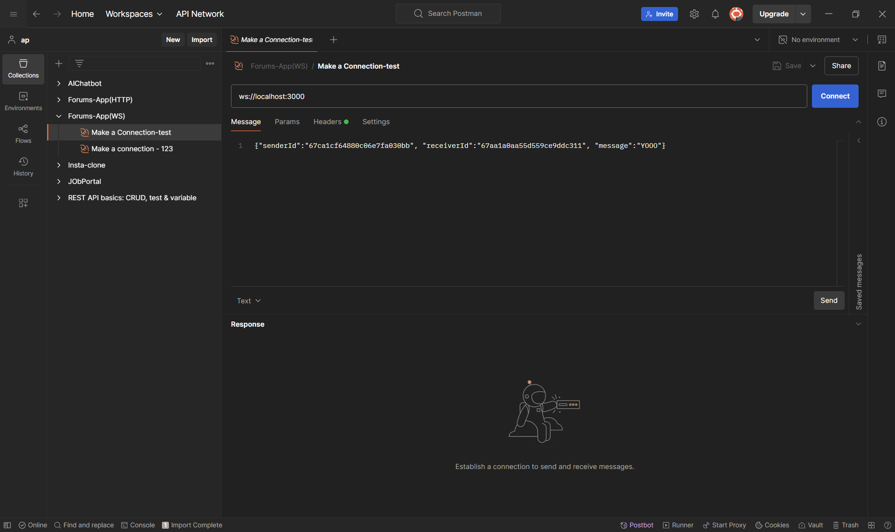
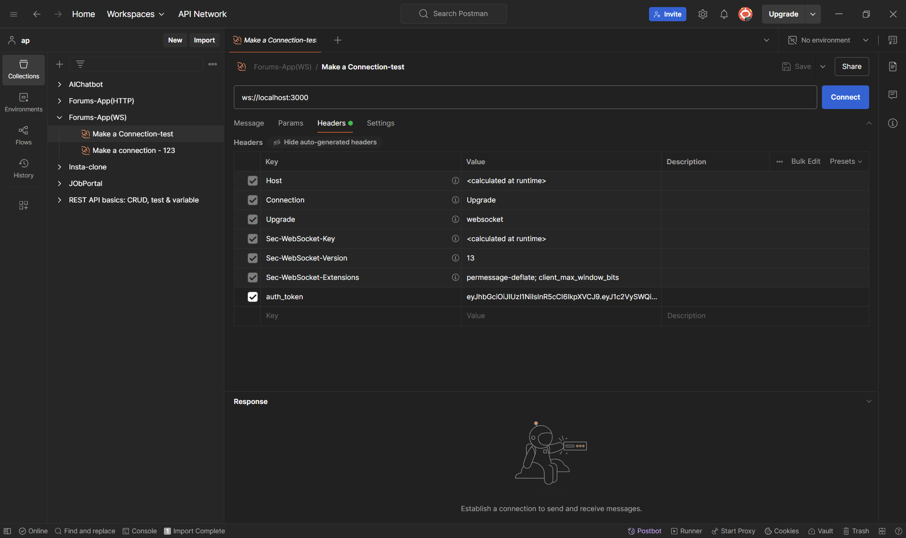

# JoyGram
> A social media platform for posting pictures and chatting.

## Team - The Three Musketeers  
**Group Members:**  
- Anandpravesh Singh  
- Abdirizaq Mukhtar  
- Wesam Rabee  

### GitHub Repository  
[Backend Repository](https://github.com/Anand-Singh01/Forums_App_MERN_Backend)  

## Getting Started  

### Backend Setup  
```sh
cd backend && npm install && npm run dev
```

### Chatting Feature Prerequisite  
Ensure you have a Redis instance running on Docker at port `6379`:  

1. Download the Redis image (if not already pulled):  
   ```sh
   docker pull redis
   ```  
2. Run a Redis container:  
   ```sh
   docker run -d --name redis-container -p 6379:6379 redis
   ```  

If you already have a Redis container but it's stopped, start it with:  
```sh
docker start redis-container
```

## WebSocket Messaging  
- When sending a message, ensure you include the following fields:  
  - `senderId`
  - `receiverId`
  - `content`

    

- **Authentication:**  
  - Manually add the authentication token in the request headers.  
  - Token will be generated from this endpoint after logging in:  
    ```
    http://localhost:3000/api/auth/get-ws-token
    ```  

  
```
